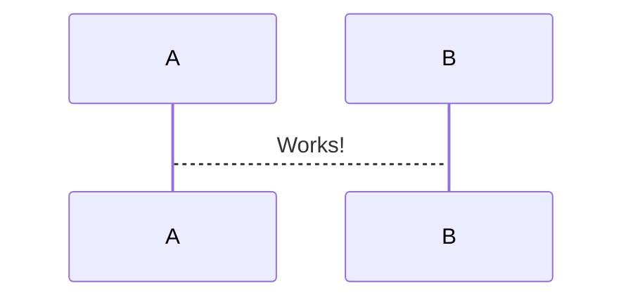
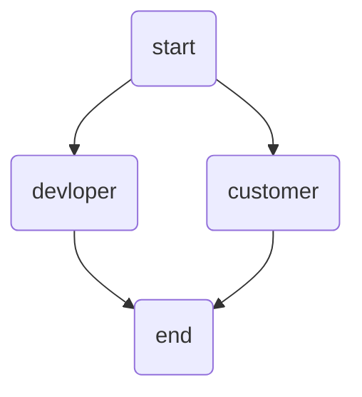

# localSetting

## conf files

### nginx folder tree

```sh
$ sudo tree /etc/nginx/

/etc/nginx/
├── conf.d
│   ├── default.conf    <<
│   ├── server.conf     <<
│   └── well-known.conf <<
├── fastcgi_params
├── koi-utf
├── koi-win
├── mime.types
├── modules
├── nginx.conf          <<
├── scgi_params
├── uwsgi_params
└── win-utf
```

## 証明書を発行

certbot (letsEncrypt を自動化) コマンドでリモートアクセスして発行
`$ sudo certbot certonly -a webroot --webroot-path=/usr/share/nginx/html -d m96d.tk`

### question

Enter email address (used for urgent renewal and security notices) (Enter 'c' tocancel):
> MAIL@MAIL.COM | 認証用のメールアドレス、受信可能なアドレス

Please read the Terms of Service at (A)gree/(C)ancel: A
> AGREE | 利用規約

Let's Encrypt project and the non-profit organization that develops Certbot?

> NO | certbotの開発に参加するか?

しばらく待つ、

### result

成功したら証明書が作成される。pem ファイル

Congratulations! Your certificate and chain have been saved at:

```sh
Using the webroot path
/usr/share/nginx/html

Your certificate and chain have been saved at
/etc/letsencrypt/live/m96d.tk/fullchain.pem

Your key file has been saved at:
/etc/letsencrypt/live/m96d.tk/privkey.pem

Your cert will expire on
2018-06-05.
```

## 鍵を生成

`sudo openssl dhparam -out /etc/ssl/certs/dhparam.pem 2048`

- [x] m96d.tk
- [ ] cms.m96d.tk
- [ ] time.m96d.tk
- [ ] rylogin.m96d.tk

## Automatic certificate renewal

発行された証明書は90日が有効期限、90日立つ前に CronJob で更新する

`$ sudo crontab -e`
And put the following content inside

```sh
15 4 * * 1 /usr/bin/certbot renew >> /var/log/renew-certs.log
18 4 * * 1 /usr/bin/systemctl reload nginx
```

every Monday morning at 4:15 AM
> 月1くらいにしておく

scp takayukio@gcloud:/etc/sysconfig/jenkins .
scp takayukio@gcloud:~/scptest.txt .
scp rootgcloud:/etc/sysconfig/jenkins .

## Mermaid



TopDown


